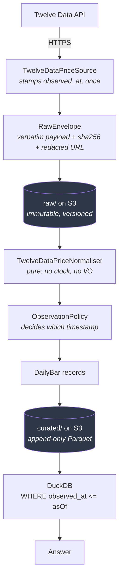

# pit-marketdata

A point-in-time market data warehouse for US equities.

It exists to answer one question correctly:

> **What was knowable about instrument X on date D?**

[](https://github.com/Brandon-Hale/pit-marketdata/actions/workflows/ci.yml)
[](https://github.com/Brandon-Hale/pit-marketdata/actions/workflows/terraform.yml)

---

## The problem

Almost every home-built market data store leaks the future, and does it silently.

You download ten years of history today and analyse a strategy "as of" 2020. But the prices
you hold have been retroactively adjusted for every split and dividend since — so the 2020
numbers in your database were never the 2020 numbers anyone could see. Your backtest quietly
consults data that did not exist yet, reports an edge, and the edge evaporates in production.

The failure is not a bug you can find by reading the code. Nothing throws. The numbers look
plausible. That is what makes it dangerous.

**A concrete instance.** Apple closed at **$342.99** on 15 June 2020. Ask any vendor today
and you will be told **$85.75** — the price re-based for the 4-for-1 split that happened
eleven weeks later, on 31 August. Both numbers are "correct". Only one of them was knowable
on 15 June, and it is not the one you will be handed.

## The approach

Every fact carries **two** timestamps:

| Column | Meaning |
|---|---|
| `effective_date` | the date the fact is *about* |
| `observed_at` | the UTC instant the fact was *learned* |

Rows are append-only — a restatement is a *new* row alongside the original, never an update.
Every read takes an `asOf` parameter, filters `observed_at <= asOf`, and takes the latest
surviving row per key.

Lookahead bias is therefore prevented **structurally, by the data model** rather than by
developer discipline. You cannot accidentally query the future, because the read path has no
way to express it.

Two supporting rules do most of the remaining work:

- **Prices are stored unadjusted.** Corporate actions live in a separate dataset, and
  adjustment factors are computed at query time from only those actions known as at `asOf`.
  Vendor-adjusted history is rewritten after every corporate action, which is precisely what
  makes it irreproducible. Twelve Data returns split-adjusted prices, so ingest divides by
  the split factor to recover what was actually quoted, and records which splits payload it
  used so a rebuild redoes identical arithmetic.
- **`observed_at` is stamped at fetch time into an immutable raw payload**, then copied
  through. Normalisation is a pure function of the raw store, so the curated data can be
  dropped and rebuilt byte-identically, years later, with no vendor calls.

---

## Status

**Stages 0–5 are complete.** 151 tests, green in CI. Infrastructure is applied, the
scheduled function is deployed, and there is real data in the warehouse.

| Stage | Deliverable | Status |
|---|---|---|
| 0 | Repo, solution, pinned package baseline, CI | ✅ Done |
| 1 | Infrastructure — Terraform: S3, DynamoDB, billing alarms | ✅ Done, applied |
| 2 | Data layer — domain, Parquet schemas, stores, repositories | ✅ Done |
| 3 | Integration — Twelve Data source, raw envelope, normalisers, ingest | ✅ Done |
| 4 | Query layer — as-of reads, adjustment, **8 temporal tests** | ✅ Done |
| 5 | Application — Lambda, schedule, CLI | ✅ Done, deployed |
| 6 | Hardening — reprocess, compaction, rebuild-from-raw proof | ⬚ Next |
| 7 | SEC EDGAR fundamentals | ⬚ Not started |

Stage 4's test suite *is* the specification — the eight temporal tests in
`app/tests/MarketData.Query.Tests/TemporalTests.cs` are what makes the guarantee real rather
than aspirational. The temporal rules themselves were fixed earlier, in Stage 2, because they
are not a feature of the read path — they are the schema.

---

## Using it

Two entry points over the same libraries: a CLI you drive, and a Lambda that runs itself on
weekdays at 22:15 UTC, after the US close.

```bash
export MARKETDATA_DATA_BUCKET=pit-marketdata-data-...
export MARKETDATA_TABLE_NAME=pit-marketdata-marketdata

marketdata watchlist add AAPL
marketdata backfill AAPL --from 2015-01-01        # 2,936 rows in ~14s
marketdata query AAPL --on 2020-06-15 --as-of 2020-07-01
marketdata query AAPL --on 2020-06-15 --as-of 2026-09-08
```

Real output from those last two commands:

```
2020-06-15  O   333.25  H   345.68  L   332.58  C   342.99  V  34,702,200  [INFERRED]
2020-06-15  O  83.3125  H    86.42  L   83.145  C  85.7475  V 138,808,800  [INFERRED]
```

Same stored row. The first is what Apple actually traded at that day; the second is the same
day re-based for the 4-for-1 split that happened eleven weeks later. Volume moves inversely.
Nothing in the query says anything about splits — the `asOf` filter runs over prices and
corporate actions alike, and the arithmetic falls out.

`--as-of` is **required** on `query`. There is no overload without it, in the CLI or the
library: a convenience default of "now" is exactly how lookahead bias would return.

## How it works

### The pipeline



### Why fetching and parsing are separate

This is the design decision everything else hangs off.

The **fetcher** touches the network and stamps `observed_at` exactly once, into the envelope.
The **normaliser** is a pure function of that envelope — it takes no clock, does no I/O, and
reads no prior state.

That split is what makes the curated store disposable. Re-run the normaliser over the raw
store years later and you get byte-identical output, because the timestamp it copies is
already in the file. A normaliser that called `DateTimeOffset.UtcNow` would produce different
data on every rebuild, and the guarantee would be gone.

The timestamp *decision* is therefore a third, separate thing — `ObservationPolicy` — because
it needs prior knowledge, which a pure parser cannot have:

| Prior state | Fetch timing | Result |
|---|---|---|
| Not known | within the live window of publication | `Observed` at the real fetch instant |
| Not known | long after publication (backfill) | `Inferred` at the reconstructed publication time |
| Known, different close | any | `Observed` at the real fetch instant — a restatement is real news |
| Known, same close | any | **nothing written** — nothing was learned |

That last row is what stops a daily full-history payload from re-ingesting thousands of
unchanged rows. And the third row is a guardrail: a vendor correcting a 2020 bar in 2027 must
*not* get an inferred 2020 timestamp, or the correction would claim to have been knowable
before it existed.

### Projects and the dependency rule

Three class libraries. Arrows point at dependencies — and nothing ever points *into*
`Domain`:

```
                 MarketData.Domain
            records + temporal rules
              ZERO package references
                   ▲          ▲
          ┌────────┘          └────────┐
          │                            │
  MarketData.Storage            MarketData.Sources
  Parquet.Net, AWS SDK          HttpClient
          ▲                            │
          └────────────────────────────┘
```

`Domain` cannot reference AWS, Parquet, or `HttpClient` — so the rules about *what a price
fact means* can never tangle with *how it gets stored*. That boundary is enforced twice: by
the compiler, and by a test that reads `MarketData.Domain.csproj` as text and fails if the
string `PackageReference` appears in it.

### Storage layout

```
raw/source=twelvedata/dataset=prices_daily/dt=2026-09-08/AAPL.json
    └─ the vendor's exact bytes, an observed_at, a SHA-256, and a key-redacted URL.
       Written once. Never modified. Versioned. Moves to Infrequent Access at 90 days.

curated/dataset=prices_daily/year=2020/part-<runId>-<guid>.parquet
    └─ append-only. Every ingest writes NEW parts; nothing is updated or deleted.
       The GUID guarantees two runs never collide. DuckDB reads the whole tree as one table.
```

DynamoDB holds the small mutable state: the watchlist (itself point-in-time — `ActiveAsync`
takes an `asOf`, so you know *when* each symbol started being tracked), per-stream fetch
cursors, and instrument reference data including `cik` for the later EDGAR join.

### Reads go through DuckDB, writes through Parquet.Net

Deliberately asymmetric. Parquet.Net 6's class deserializer fails on plain `string`
properties, and DuckDB is the production read path regardless — so tests assert what
production will actually see, by querying the files rather than round-tripping the writer.

---

## Stack

| Concern | Choice |
|---|---|
| Language | C# / .NET 10 |
| Storage | Parquet on S3 (curated), JSON on S3 (raw, permanent) |
| State | DynamoDB — watchlist, cursors, run records |
| Compute | AWS Lambda, ARM64, one scheduled function |
| Infrastructure | Terraform 1.14, AWS provider 6.x |
| Query | DuckDB over Parquet |
| Tests | xUnit v3 on Microsoft.Testing.Platform, Shouldly, Testcontainers/LocalStack |
| Region | `ap-southeast-2` (Sydney); billing alarms in `us-east-1`, where AWS requires them |

`.NET` was chosen over Python for two concrete reasons: `Parquet.Net` is pure managed code
with no native dependency, so Lambda packages need no layer; and `DateOnly` and
`DateTimeOffset` are distinct types, meaning this project's single most dangerous bug class —
confusing the date a fact is about with the date it was learned — is caught by the compiler.

Analysis is deliberately *not* coupled to that choice. The interop contract is Parquet on S3,
so later statistical work can be done from Python against the same files with the same `asOf`
predicate, with nothing to port.

## Layout

```
app/                    the .NET solution
  MarketData.slnx
  Directory.Packages.props     all versions pinned centrally
  src/MarketData.Domain/       facts, publication clock, observation policy
  src/MarketData.Storage/      raw + curated stores (local and S3), DynamoDB repos
  src/MarketData.Sources/      Twelve Data fetch, normalisers, ingest orchestration
  tests/                       Domain · Storage · Sources · Integration (LocalStack)
infra/terraform/        bootstrap (state bucket) + modules/storage + modules/observability
scripts/                verify-vendor.sh
docs/                   design spec and implementation plans
```

## Running it

```bash
# All tests. Integration tests self-skip if Docker is unavailable.
cd app && dotnet test

# Confirm the vendor still provides what the design depends on.
TWELVEDATA_API_KEY=<key> ./scripts/verify-vendor.sh

# Infrastructure. Validation needs no credentials.
cd infra/terraform && terraform init -backend=false && terraform validate
```

There is no application to run yet — see [Status](#status).

## Scope

US equities, daily bars, an opt-in watchlist of roughly 15–20 symbols. Not a full-market
dataset and not trying to be.

Known limitations — survivorship bias from an opt-in universe, inferred timestamps on
backfilled history, and single-vendor risk — are documented in
[§10 of the design](docs/superpowers/specs/2026-09-08-layer1-point-in-time-market-data-design.md#10-known-limitations)
rather than discovered later.

## Non-goals

No signals, no screeners, no backtesting, no UI. This layer is the foundation those would
stand on, and it is worth nothing if it leaks.

## Licence

MIT
