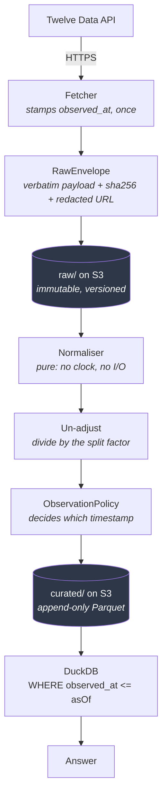

# pit-marketdata

A point-in-time market data warehouse for US equities.

It exists to answer one question correctly:

> **What was knowable about instrument X on date D?**

[](https://github.com/Brandon-Hale/pit-marketdata/actions/workflows/ci.yml)
[](https://github.com/Brandon-Hale/pit-marketdata/actions/workflows/terraform.yml)

---

## The problem

Almost every home-built market data store leaks the future, and does it silently.

You download ten years of history today and analyse a strategy "as of" 2020. But the prices
you hold have been retroactively adjusted for every split and dividend since — so the 2020
numbers in your database were never the 2020 numbers anyone could see. Your backtest quietly
consults data that did not exist yet, reports an edge, and the edge evaporates in production.

The failure is not a bug you can find by reading the code. Nothing throws. The numbers look
plausible. That is what makes it dangerous.

**A concrete instance, and the one this project is tested against.** Apple closed at
**$342.99** on 15 June 2020. Ask any vendor today and you will be told **$85.75** — the price
re-based for the 4-for-1 split that happened eleven weeks later. Both numbers are "correct".
Only one of them was knowable on 15 June, and it is not the one you will be handed.

## The approach

Every fact carries **two** timestamps:

| Column | Meaning |
|---|---|
| `effective_date` | the date the fact is *about* |
| `observed_at` | the UTC instant the fact was *learned* |

Rows are append-only — a restatement is a *new* row alongside the original, never an update.
Every read takes an `asOf`, filters `observed_at <= asOf`, and takes the latest surviving row
per key.

Lookahead bias is therefore prevented **structurally, by the data model** rather than by
developer discipline. You cannot accidentally query the future, because the read path has no
way to express it.

Three supporting rules do most of the remaining work:

- **Prices are stored unadjusted.** Corporate actions live in a separate dataset and
  adjustment factors are computed at query time, from only those actions known as at `asOf`.
  Vendor-adjusted history is rewritten after every corporate action, which is precisely what
  makes it irreproducible. Twelve Data returns split-adjusted prices, so ingest divides by the
  split factor to recover what was actually quoted, and records which splits payload it used
  so a rebuild redoes identical arithmetic.
- **`observed_at` is stamped once, at fetch, into an immutable raw payload**, then copied
  through. Normalisation is a pure function of the raw store, so curated data can be dropped
  and rebuilt years later with no vendor calls.
- **A restatement never gets a reconstructed timestamp.** If a vendor corrects a 2020 bar in
  2027, that correction is stamped 2027 — claiming otherwise would say the corrected value was
  knowable before it existed.

---

## Using it

Two entry points over the same libraries: a **CLI** you drive, and a **Lambda** that runs
itself on weekdays at 22:15 UTC, after the US close.

### Track a symbol

```bash
marketdata watchlist add NVDA                 # start tracking it
marketdata backfill NVDA --from 2015-01-01    # fetch history once, ~14s for 2,900 bars
```

Two steps on purpose. `watchlist add` means *track this from now on*; `backfill` means *and go
get the history*. From then on the scheduled function keeps it current — you never backfill
that symbol again.

### Ask what was knowable

```bash
marketdata query AAPL --on 2020-06-15 --as-of 2020-07-01
marketdata query AAPL --on 2020-06-15 --as-of 2026-09-08
```

```
2020-06-15  O   333.25  H   345.68  L   332.58  C   342.99  V  34,702,200  [INFERRED]
2020-06-15  O  83.3125  H    86.42  L   83.145  C  85.7475  V 138,808,800  [INFERRED]
```

The same stored row. The first line is what Apple actually traded at that day; the second is
that day re-based for the split it did not yet know about. Volume moves inversely.

Nothing in the query mentions splits. The `asOf` filter runs over prices **and** corporate
actions, the split is simply invisible before its ex-date, and the arithmetic falls out.

### Corporate actions the vendor will not sell you

Twelve Data's free tier serves splits and dividends for **AAPL only** and answers 403 for
everything else. Its prices are split-adjusted, so any other symbol needs its split history
from somewhere or the stored prices would be adjusted values labelled as unadjusted.

Enter them by hand. Splits are public and announced weeks ahead, so this costs minutes a year:

```bash
marketdata action add NVDA  --ex-date 2024-06-10 --split --from 1 --to 10
marketdata action add AMZN  --ex-date 2022-06-06 --split --from 1 --to 20
```

Factors rather than a ratio, because 1/7 cannot be typed as a decimal without carrying
rounding into every adjusted price derived from it. A hand-entered action is a first-class
fact — same `observed_at` (the ex-date), same `INFERRED` kind, same append-only semantics —
differing only in `source = MANUAL`. The query layer cannot tell them apart.

Ingest **fails loudly** for a symbol with no split history rather than storing adjusted
prices as if they were raw.

### Other options

```bash
marketdata query AAPL --from 2020-06-01 --to 2020-06-30 --as-of 2020-07-01
marketdata query AAPL --on 2020-06-15 --as-of 2026-09-08 --adjust none   # exactly as quoted
marketdata query AAPL --on 2020-06-15 --as-of 2026-09-08 --adjust all    # + dividends
marketdata query AAPL --from 2026-09-01 --to 2026-09-08 --as-of 2026-09-08 --observed-only
marketdata watchlist list --as-of 2020-01-01    # what was being tracked back then
```

`--as-of` is **UTC** unless you give an offset. `2024-06-08` means `2024-06-08T00:00:00Z`,
not local midnight — every timestamp in the store is UTC, and reading input in the machine's
zone would silently shift the answer.

**`--as-of` is required on `query`** and the command errors without it. There is no overload
without it in the library either. A convenience default of "now" is exactly how lookahead bias
would return, and a CLI is where such a convenience would most plausibly be added.

### Setup

The CLI needs two environment variables and runs through `dotnet run`. A shell function makes
it typeable:

```powershell
$env:MARKETDATA_DATA_BUCKET = "pit-marketdata-data-..."
$env:MARKETDATA_TABLE_NAME  = "pit-marketdata-marketdata"

function marketdata {
    dotnet run --project "<repo>\app\src\MarketData.Cli" -- @args
}
```

### Watching the scheduled runs

```bash
aws logs tail /aws/lambda/pit-marketdata-ingest --region ap-southeast-2 --since 24h
aws lambda invoke --function-name pit-marketdata-ingest --region ap-southeast-2 out.json
```

Every run also writes a `RUN#<timestamp>` record to DynamoDB — symbols attempted and
succeeded, rows written, and any errors — expiring automatically after 90 days.

---

## How it works

### The shape

Seven projects, but **one application**. Two of them run; five are libraries they share.

```
   YOU                                     AWS EVENTBRIDGE
    │  marketdata query ...                     │  weekdays 22:15 UTC
    ▼                                           ▼
┌────────────────────┐              ┌─────────────────────────┐
│  MarketData.Cli    │              │  MarketData.Lambda      │
│  carries DuckDB    │              │  no DuckDB — 6.3 MB     │
└─────────┬──────────┘              └───────────┬─────────────┘
          └────────────────┬────────────────────┘
                           ▼
                 ┌────────────────────┐
                 │ MarketData.Hosting │   one wiring, so the two
                 └─────────┬──────────┘   cannot drift apart
        ┌──────────────────┼───────────────────┐
        ▼                  ▼                   ▼
  MarketData.Sources  MarketData.Storage  MarketData.Query
   fetch + parse       S3 + DynamoDB       DuckDB as-of reads
        └──────────────────┼───────────────────┘
                           ▼
                  MarketData.Domain
               the rules — zero dependencies
```

`MarketData.Lambda` is a *library*, not an executable: the managed .NET runtime hosts it and
calls one method by name. It deliberately excludes `MarketData.Query`, and an architecture
test enforces that — carrying DuckDB would add ~60 MB and an extension download at every cold
start, for a question that in practice only ever concerns the last few days.

### The pipeline



### Why fetching and parsing are separate

This is the decision everything else hangs off.

The **fetcher** touches the network and stamps `observed_at` exactly once, into the envelope.
The **normaliser** is a pure function of that envelope — no clock, no I/O, no prior state.

That split is what makes the curated store disposable. Re-run the normaliser over the raw
store years later and you get identical output, because the timestamp it copies is already in
the file. A normaliser that called `UtcNow` would produce different data on every rebuild, and
the guarantee would be gone.

The timestamp *decision* is therefore a third, separate thing — it needs prior knowledge,
which a pure parser cannot have:

| Prior state | Fetch timing | Result |
|---|---|---|
| Not known | within the live window of publication | `Observed` at the real fetch instant |
| Not known | long after publication (backfill) | `Inferred` at the reconstructed publication time |
| Known, different close | any | `Observed` at the real fetch instant — a restatement is news |
| Known, same close | any | **nothing written** — nothing was learned |

The last row stops a daily full-history payload re-ingesting thousands of unchanged rows. The
third is the guardrail against back-dating a correction.

### The dependency rule

Arrows only ever point **inward**, toward `Domain`, which has **zero package references** —
enforced by a test that reads its `.csproj` as text and fails if `PackageReference` appears.

So the rules about *what a price fact means* can never tangle with *how it gets stored*. That
boundary is what let the Lambda drop the query layer cleanly, and it is checked by the
compiler rather than remembered.

### Storage layout

```
raw/source=twelvedata/dataset=prices_daily/dt=2026-09-08/AAPL.json
    └─ the vendor's exact bytes, an observed_at, a SHA-256, a key-redacted URL.
       Written once, never modified, versioned. Moves to Infrequent Access at 90 days.

curated/dataset=prices_daily/year=2020/part-<runId>-<guid>.parquet
    └─ append-only. Every ingest writes NEW parts; nothing is updated or deleted.
       DuckDB reads the whole tree as one table.
```

DynamoDB holds the small mutable state: the watchlist (itself point-in-time — `list --as-of`
answers what was tracked at a past date), per-symbol fetch cursors, instrument reference data,
and run records.

### Reads go through DuckDB, writes through Parquet.Net

Deliberately asymmetric. Parquet.Net 6's class deserializer fails on plain `string` properties,
and DuckDB is the production read path regardless — so tests assert what production will
actually see, by querying the files rather than round-tripping the writer.

DuckDB is embedded, not a server: a native library loaded into whichever process needs it,
reading Parquet from S3 in place. There is nothing to host and nothing to pay for.

---

## Status

**Stages 0–5 are complete and deployed.** 151 tests, green in CI. There is real data in the
warehouse.

| Stage | Deliverable | Status |
|---|---|---|
| 0 | Repo, solution, pinned package baseline, CI | ✅ Done |
| 1 | Infrastructure — Terraform: S3, DynamoDB, billing alarms | ✅ Done, applied |
| 2 | Data layer — domain, Parquet schemas, stores, repositories | ✅ Done |
| 3 | Integration — Twelve Data source, raw envelope, normalisers | ✅ Done |
| 4 | Query layer — as-of reads, adjustment, **8 temporal tests** | ✅ Done |
| 5 | Application — Lambda, schedule, CLI | ✅ Done, deployed |
| 6 | Hardening — reprocess, compaction, rebuild-from-raw proof | ⬚ Next |
| 7 | SEC EDGAR fundamentals | ⬚ Not started |

Stage 4's test suite *is* the specification — the eight temporal tests in
`app/tests/MarketData.Query.Tests/TemporalTests.cs` are what make the guarantee real rather
than aspirational. The temporal rules themselves were fixed earlier, in Stage 2, because they
are not a feature of the read path — they are the schema.

### Known limitations

Recorded as decisions, not discovered later.

- **The scheduled function detects restatements only within a ten-day window.** It answers
  "did I already know this close?" from a rolling map on the cursor rather than carrying
  DuckDB. Older restatements are stamped `Inferred`, which is wrong; Stage 6's `reprocess` is
  the fix, and a periodic wider `backfill` catches them meanwhile.
- **No alerting.** Run records capture errors, but nothing reads them. A failed run is found
  by looking.
- **Corporate actions are hand-entered for every symbol but AAPL**, because the vendor's free
  tier paywalls them. Nothing checks that a split has been recorded before its ex-date, so a
  missed one silently leaves prices unadjusted from that day.
- **Reserved concurrency is unset.** Two concurrent runs would both advance the same cursor,
  so `1` is correct — but a new AWS account's total concurrency quota is 10 and AWS refuses a
  reservation leaving fewer than 10 unreserved.
- Survivorship bias from an opt-in universe, inferred timestamps on backfilled history, and
  single-vendor risk are documented in
  [§10 of the design](docs/superpowers/specs/2026-09-08-layer1-point-in-time-market-data-design.md#10-known-limitations).

---

## Stack

| Concern | Choice |
|---|---|
| Language | C# / .NET 10 |
| Storage | Parquet on S3 (curated), JSON on S3 (raw, permanent) |
| State | DynamoDB — watchlist, cursors, instruments, run records |
| Compute | AWS Lambda, ARM64, managed `dotnet10` runtime, one scheduled function |
| Infrastructure | Terraform 1.14, AWS provider 6.x |
| Query | DuckDB over Parquet, embedded — no server |
| CLI | System.CommandLine |
| Tests | xUnit v3 on Microsoft.Testing.Platform, Shouldly, Testcontainers/LocalStack |
| Region | `ap-southeast-2` (Sydney); billing alarms in `us-east-1`, where AWS requires them |

`.NET` was chosen over Python for two concrete reasons: `Parquet.Net` is pure managed code
with no native dependency, so Lambda packages need no layer; and `DateOnly` and
`DateTimeOffset` are distinct types, meaning this project's single most dangerous bug class —
confusing the date a fact is about with the date it was learned — is caught by the compiler.

Analysis is deliberately *not* coupled to that choice. The interop contract is Parquet on S3,
so later statistical work can be done from Python against the same files with the same `asOf`
predicate, with nothing to port.

**Cost is effectively zero.** Storage is a few MB, the function runs once a weekday for about
two seconds, and every line sits inside a permanent free allowance. Billing alarms at USD 5
and 20 exist to catch the mistakes this project has not made yet.

## Layout

```
app/                       the .NET solution
  src/MarketData.Domain/     facts, publication clock, observation policy, adjustment maths
  src/MarketData.Storage/    raw + curated stores (local and S3), DynamoDB repositories
  src/MarketData.Sources/    Twelve Data fetch, normalisers, ingest orchestration
  src/MarketData.Query/      DuckDB as-of reads
  src/MarketData.Hosting/    shared composition
  src/MarketData.Lambda/     the scheduled function
  src/MarketData.Cli/        the command line
  tests/                     one project per source project, plus LocalStack integration
infra/terraform/           bootstrap, modules/storage, modules/observability, modules/ingest
scripts/                   build-lambda.sh, verify-vendor.sh
docs/superpowers/          design specs and implementation plans
```

## Development

```bash
cd app && dotnet test                    # integration tests self-skip without Docker
./scripts/verify-vendor.sh               # confirm the vendor still provides what we need
./scripts/build-lambda.sh                # publish + zip for deployment
cd infra/terraform && terraform apply     # deploy
```

## Scope

US equities, daily bars, an opt-in watchlist of roughly 15–20 symbols. Not a full-market
dataset and not trying to be.

## Non-goals

No signals, no screeners, no backtesting, no UI. This layer is the foundation those would
stand on, and it is worth nothing if it leaks.

## Licence

MIT
